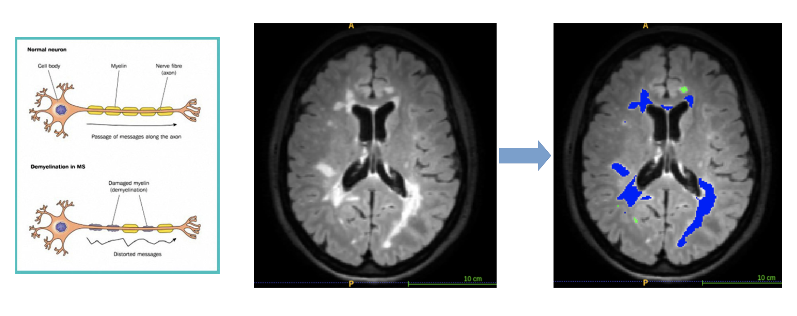
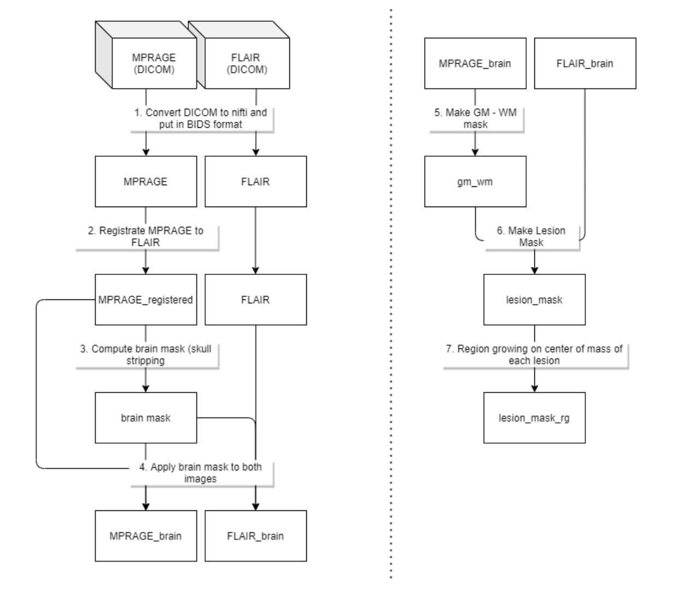

# Project in medical imaging - WSBIM2243 (EPL - BELGIUM) 
The goal of this project is to segment brain lesions in patients with Multiple Sclerosis by using a custom segmentation algorithm using multimodality (MPRAGE and FLAIR). This project is part of the course WSBIM2243 given at UCLouvain in Belgium. 

The method is compared with classical method such as Otsu, Expectation-Maximization and Region Growing.

The workflow is the following and each part is detailled in the notebook 

.  
|--- notebook                 : Containing the main jupyter notebook implementing the pipeline and images used in the notebook  
|--- utils                    : Containing all the scripts and files necessary to make the notebook functionnal  
|--- dockerfile               : Dockerfile to build the image  
|--- README.md  
 

The project can be opened as a Docker app : 

- Download and install Docker Desktop on Mac/Windows or Docker engine on Linux
- In command line, type : "docker pull amsingh05/wsbim2243:latest"
- In command line, type : "docker run -it -p 8888:8888 amsingh05/wsbim2243"
- Copy and paste the URL (http://127.0.0.1:8888/?token=...) given in the command line on a browser.
- It should open Jupyter notebook. Now you can open the latest update of the notebook with packages pre-installed.
